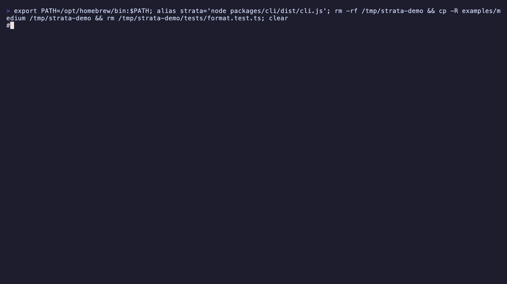

# Strata

**A structural code substrate for AI agents — built to replace git worktrees as the way multiple coding agents share a codebase.** Strata replaces the file abstraction with a persistent, queryable node graph. An AI agent addresses functions, declarations, and identifiers by stable ID; mutates them through structural operations inside transactions; verifies against a real type-checker; and never sees a filesystem.

Not a git replacement — git keeps history, review, and distribution. What Strata replaces is the **concurrency layer**: today, running N coding agents means one git worktree per agent and a merge/integration step afterward, resolving conflicts by diff after they've happened. In Strata, agents work in one canonical graph, the substrate infers what each typed operation touches, and conflicts are scheduled away *before* they happen — the merge step doesn't exist.

The hypothesis: AI coding agents are bottlenecked by files. Same model, same task — a structural substrate should get to the right answer with materially less work. And because the substrate can see what every change touches, multiple agents should be able to share one canonical codebase directly — no branches, no worktrees, no merge step. That multi-agent question is what Strata was built to answer.


*The key-free explore chain on `examples/medium`: list modules, find a declaration, inspect its node, then ask the thing files can't answer — every resolved reference. Recorded with [vhs](https://github.com/charmbracelet/vhs) from [`docs/demo/strata-explore.tape`](docs/demo/strata-explore.tape).*



*The sequel: an agent with no filesystem tools renames the interface across all 16 reference sites in one transaction — validated by tsc plus the project's tests before the commit gate lets it through. 6 tool calls, ~$0.05, ~25 s ([`docs/demo/strata-agent.tape`](docs/demo/strata-agent.tape)).*

## Headline results

**Multi-agent — the original question.** The baseline is today's actual practice: one git worktree per agent plus an integration agent that merges the results. The Strata arm replaces that layer — two concurrent agents in one canonical codebase through the Rust coordination kernel, no branches, no worktrees, no merge step — with the same model, corpus, and final tsc+tests acceptance on both sides:

| N=3 directional round (5 evaluable scenarios) | Result |
|---|---|
| Directional consistency | `+++` on **both** cost and makespan in every scenario — all 30 evaluable cells favored Strata, no reversal, no tie |
| Cost margins (baseline/Strata, per pair) | 2.5–10.7× |
| Makespan margins (dispatch → one shared green codebase) | 4.6–25.6× |
| Strata arm reliability | 18/18 green; the pre-registered falsifiers (silent overwrite, dirty read, partial commit) never occurred |

Directional consistency at N=3 under one model/corpus/seed/machine — no significance or generality claim. Full evidence chain: [deterministic acceptance](docs/spikes/2026-07-15-deterministic-full-key-free-acceptance.md) → [pilot](docs/spikes/2026-07-17-phase-6-live-pilot-results.md) → [retry](docs/spikes/2026-07-18-phase-6-live-xm-retry-results.md) → [N=3 round](docs/spikes/2026-07-18-phase-6-n3-directional-results.md).

**Single-agent — the foundation.** On a reference-aware **rename** across a real multi-module TypeScript codebase — same model (`claude-sonnet-4-6`), same prompt, same success bar, one shared scoring core — a Strata agent (no filesystem tools) vs. a file-editing baseline agent:

| | Substrate | Baseline |
|---|---|---|
| Total tokens (N=3) | 1201–1473 | 4450–4682 |
| Wall time | 24.6–30.3 s | 57.4–59.4 s |
| Tool/edit calls | 7–11 | 25–27 |

Disjoint distributions, ~3.5× fewer tokens, ~2.2× faster, both 3/3 success with identical output quality. Observed separation at N=3 (not a significance claim), and it is robust — it survived a fully adversarially-validated harness and a prompt change.

**Honest scope:** the substrate's single-agent cost edge is specific to bulk propagation (rename/move/parameter fan-out over many references); single-site synthesis stays cheaper with file tools, and one per-callsite expressiveness task is a precisely-bounded negative — all documented in **[`docs/RESULTS.md`](docs/RESULTS.md)**; the full decision trail is in **[`decisions.md`](decisions.md)**.

**📄 The write-up — [When does a structural substrate beat files?](docs/write-up.md)** — is the narrative version: the result, the task-class boundary, where it sits in prior art, and why the numbers are trustworthy.

## Architecture

```
agent  (@strata-code/agent)   headless Claude Agent SDK, structural tools only, no fs
  └─ tools (20)          query · transaction · structural mutation · validate · semantic_search
store  (@strata-code/store)   SQLite node graph + edges + operation log + transactions
  └─ vector index        sqlite-vec; declaration + commit-pattern embeddings (optional)
ingest (@strata-code/ingest)  TypeScript → nodes (TS Compiler API)
render (@strata-code/render)  nodes → canonical TypeScript (+ source map)
verify (@strata-code/verify)  in-process tsc over rendered output; commit gate
bench  (@strata-code/bench)   substrate vs. file-baseline harness, distributions
kernel (crates/strata-kernel) Rust/redb multi-agent coordination daemon: typed
                              operations, graph-inferred leases, fenced
                              only-green publication (research path, not on npm)
```

Files are not first-class: they exist only as transient render artifacts for `tsc`. The operation log is canonical history (no git-style commits inside the store). See [`strata-design.md`](strata-design.md) for the full design and [`decisions.md`](decisions.md) for the append-only record of every build-time decision and divergence.

For a visual map of the current implementation, see [`docs/architecture-visual-guide.md`](docs/architecture-visual-guide.md).

## Three-layer codebase index

The agent gets a structural view of the codebase at session start. Each layer is independently demoable and gracefully disables when its prerequisites aren't met.

- **L1 — static module index (always-on).** Every `strata agent` invocation injects a compact `## Codebase shape` section at the top of the agent's first prompt: every Module's top-level declarations (kind, name, exported?), plus the on-disk `tests/` listing. ~10–50 tokens per module. Disable with `--no-index`. Design: [`docs/specs/2026-05-26-three-layer-codebase-index-design.md`](docs/specs/2026-05-26-three-layer-codebase-index-design.md).
- **L2 — vector-augmented retrieval.** `sqlite-vec` virtual tables store per-declaration embeddings; a `semantic_search(query, k?)` tool returns top-K declarations with their structural metadata. Auto-embeds at session start when `STRATA_EMBED_API_KEY` is set; silently skipped otherwise. Use when the agent doesn't know the symbol name.
- **L3 — operation log as memory.** Every committed transaction captures its triggering prompt and embeds a commit pattern (prompt + ops + modules + declarations). At session start the agent's prompt is matched against past patterns; similar past tasks are injected as `## Past tasks like this one`. Cold-start (no prior commits) is silent — no section, no log noise.

All three layers preserve the canonical invariants: stable node IDs, files-not-first-class, operation log as canonical history.

## Quick start

Install from npm (the `strata` command):

```bash
npm i -g @strata-code/cli

strata modules ./my-ts-project      # then: find, show, refs, exports, search — see below
```

Or work from source — for a hands-on walkthrough that takes you from clone to "I see L1 working" with real commands and real output, see [`docs/quickstart.md`](docs/quickstart.md). The reference commands are below.

```bash
pnpm install
pnpm -r build
pnpm -r test                                          # ~470 passing, key-gated tests skipped
```

Round-trip a single TypeScript file through the substrate (no key, no network):

```bash
node packages/cli/dist/cli.js roundtrip examples/phase0-sample.ts
```

Run the rename acceptance (programmatic, no key):

```bash
node packages/cli/dist/cli.js t03 examples/medium
```

### Explore the graph (no key, no network)

Six read-only commands expose the substrate's query primitives to a human. `<source>` is either a corpus directory (ingested ephemerally into memory — zero setup) or a persisted `.db`:

```bash
strata() { node packages/cli/dist/cli.js "$@"; }

strata modules examples/medium                    # every module + its node ID (alias: ls)
strata exports examples/medium lib/format.ts      # one module's top-level declarations
strata find    examples/medium User               # find declarations by name [--kind interface|type-alias|class|function|variable]
strata show    examples/medium <nodeId>           # a node's source text + structure
strata refs    examples/medium <nodeId>           # every resolved reference, across modules
strata search  examples/medium "date helpers"     # semantic search (needs embeddings; see below)
```

The workflow is a chain: discovery commands (`modules`/`exports`/`find`) print node IDs; you paste one into inspection commands (`show`/`refs`). IDs are deterministic for an unchanged corpus directory, so the chain works even without a persisted db. `refs` is the capability files can't offer — the resolved reference graph, including type positions and JSDoc, with string-literal look-alikes correctly excluded. Every command takes `--json` for piping to `jq`.

### Run the agent on a real corpus

Needs `ANTHROPIC_API_KEY` (or `CLAUDE_CODE_OAUTH_TOKEN`):

```bash
ANTHROPIC_API_KEY=... node packages/cli/dist/cli.js agent examples/medium \
  "Rename the exported interface User to Account everywhere it is referenced" \
  --db /tmp/strata-medium.db --print
```

- `--db <path>` persists the operation log and node graph across sessions (re-invoke against the same path to continue).
- `--reset` deletes that DB before re-ingesting.
- `--no-index` disables L1 injection (useful for paired comparisons).
- `--print` streams assistant text + tool calls to stdout.
- `--model <id>` defaults to `claude-sonnet-4-6`.

The session JSON to stdout shows token cost, tool-call count, terminal reason, and the resulting DB path.

### Enable L2 + L3 (optional)

Set `STRATA_EMBED_API_KEY` (OpenAI) alongside the model key, then re-run `strata agent`. The first run embeds the corpus (one-time cost, ~$0.04 per 10k declarations at text-embedding-3-small); subsequent runs against the same `--db` reuse the embeddings.

Explicit re-embed against a persisted store:

```bash
STRATA_EMBED_API_KEY=... node packages/cli/dist/cli.js embed examples/medium --db /tmp/strata-medium.db
```

### Paired comparison: file-tools baseline

Same prompt, same corpus, Claude Code with read/edit/grep tools on a temp clone:

```bash
ANTHROPIC_API_KEY=... node packages/cli/dist/cli.js baseline examples/medium \
  "Rename the exported interface User to Account everywhere it is referenced" \
  --print
```

### L1 paired dogfood

A keyed micro-experiment: run the same T05-style task twice on the same corpus, once with L1 off (`--no-index`) and once with L1 on. Prints a comparison table with token deltas:

```bash
ANTHROPIC_API_KEY=... pnpm --filter @strata-code/bench dogfood:l1 -- examples/medium
```

Honest read: N=1. Plan acceptance is `index-on tokens ≤ 80% of index-off tokens` on this single run.

## Status

Research-grade substrate, **actively iterating toward usability** (CLAUDE.md priority since 2026-05-26). TypeScript only. The end-to-end pipeline is stable: ingest → store → 17 structural tools → in-process tsc + behavioral gate → render. T03 (rename) is a clean substrate win on the bench; other tasks are mixed or losses, documented honestly in `docs/RESULTS.md`. The three-layer codebase index (L1/L2/L3) is implemented and tested but the design-level token-saving claim is unvalidated until the operator runs the L1.4 dogfood (above).

Live roadmap: [`docs/product-roadmap.md`](docs/product-roadmap.md).

The current release is not production-grade, multi-language, or multi-client. Multi-agent code coordination is now the approved next research iteration (`docs/superpowers/specs/2026-07-13-multi-agent-coordination-kernel-design.md`); multi-language support, FUSE, Git integration, task orchestration, and multi-host consensus remain out of scope.

## License

[MIT](LICENSE)
