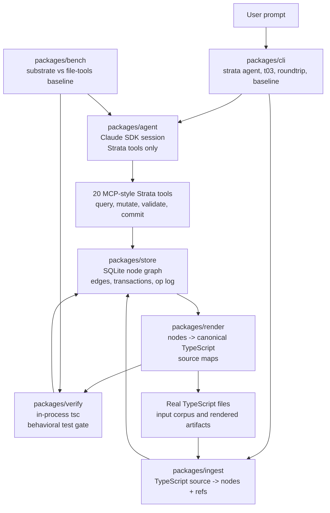
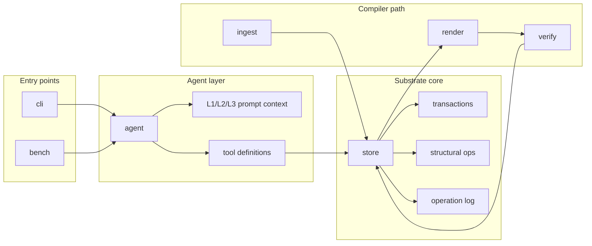
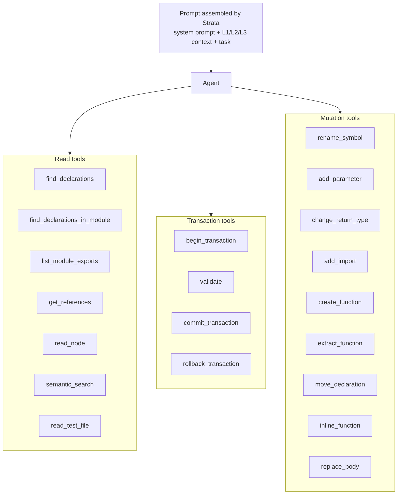
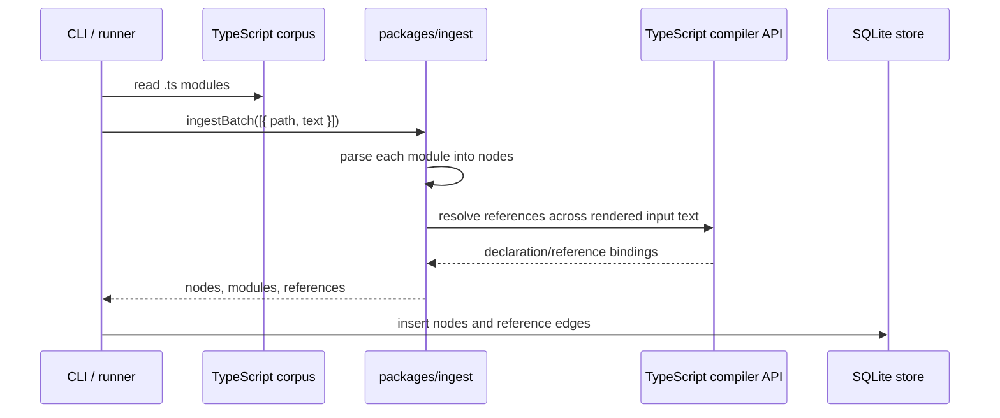
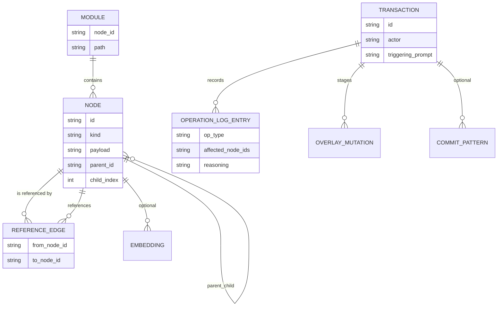
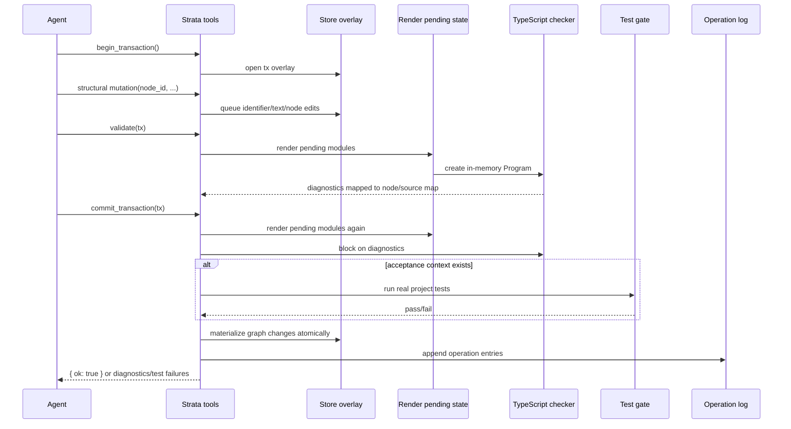
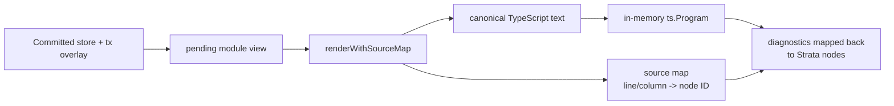
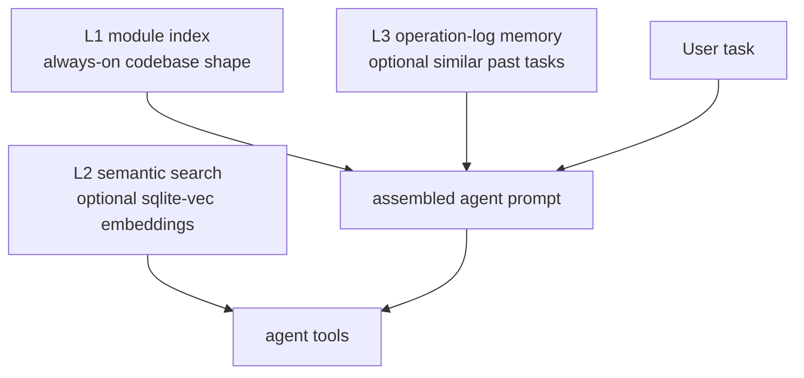
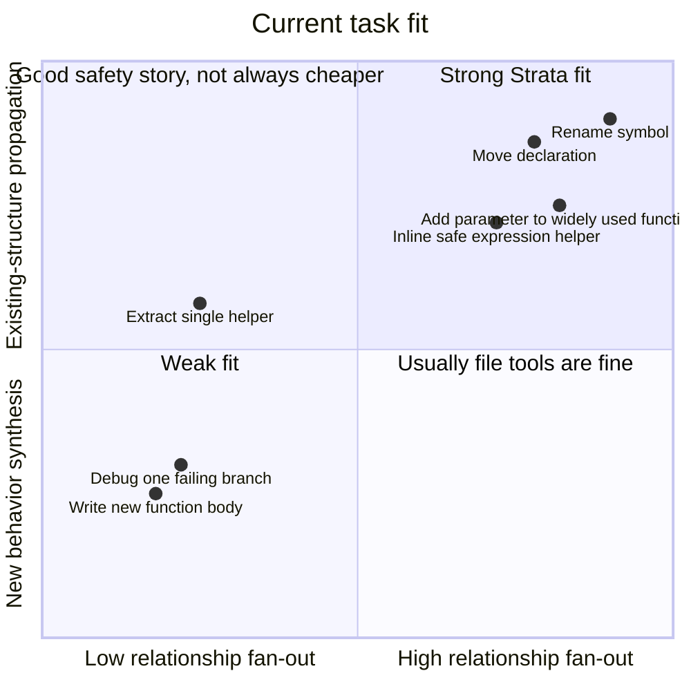
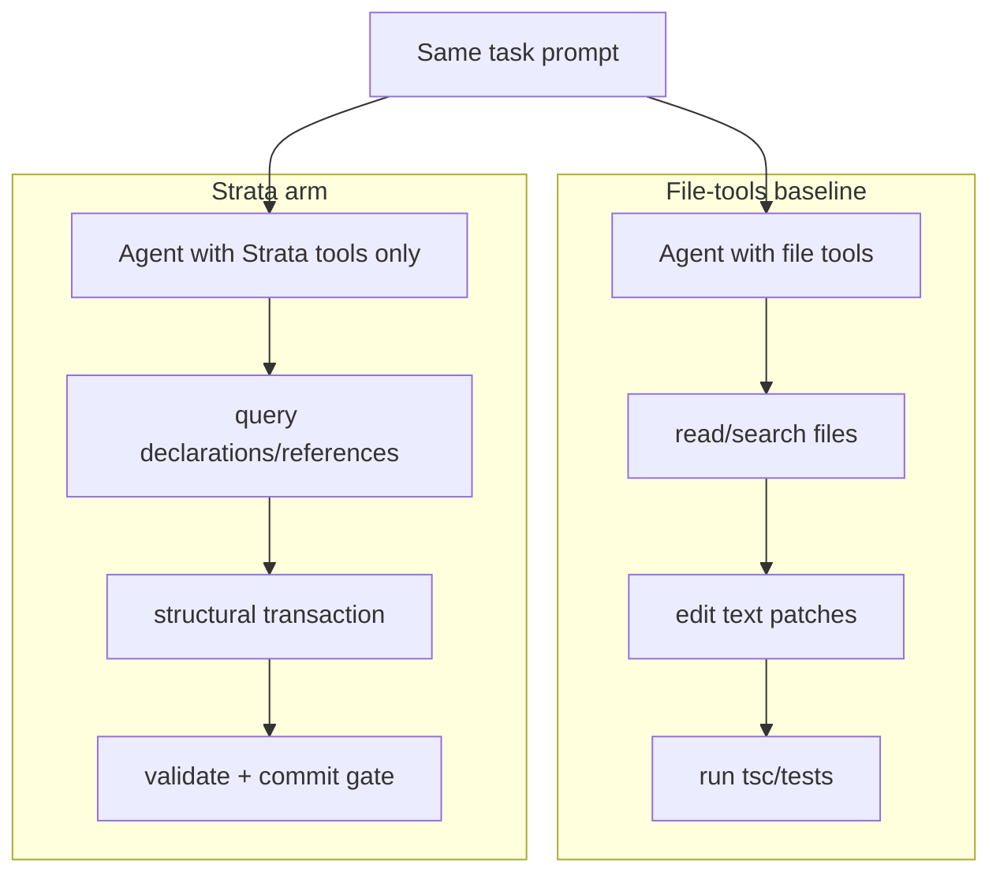

# Strata architecture visual guide

This document is a picture-first map of what Strata does today. It is meant
for orientation: where code enters the substrate, what the agent can see, how
mutations flow, and where files still exist.

## One-sentence model

Strata turns a TypeScript project into a SQLite-backed structural graph, lets an
agent change that graph through typed transactional tools, validates the pending
state with TypeScript/tests, then renders TypeScript files as artifacts.

## System overview

The important boundary: the agent does not edit files. The agent sees node IDs,
declarations, references, diagnostics, and tool results. Files are input to
ingest and output from render/verify.

## Package roles

| Package | Current responsibility |
| --- | --- |
| `packages/cli` | User-facing commands and local dogfood paths. |
| `packages/agent` | Agent session, prompt assembly, structural tool server, baseline runner. |
| `packages/store` | Node rows, reference edges, transactions, operation log, structural mutations, semantic search tables. |
| `packages/ingest` | TypeScript corpus to module/declaration/identifier nodes plus reference edges. |
| `packages/render` | Stored nodes back to canonical TypeScript text and source maps. |
| `packages/verify` | Render pending state, run TypeScript diagnostics, materialize committed graph changes, optional test gate. |
| `packages/bench` | Paired comparisons and dogfood harnesses. |

## Current agent worldview

The strongest tool class is bulk propagation over known edges: rename a symbol,
move a declaration and repoint importers, add a parameter at every resolved
direct call site, or inline a function at every safe call site.

## Ingest path

The initial graph is statement/declaration oriented. Module paths exist as
module metadata and render coordinates, but the agent acts on node IDs rather
than file paths.

## Store model

This is conceptual rather than exact schema naming. The invariant that matters:
the store is the canonical code state, and committed mutations are recorded in
the operation log.

## Mutation and commit flow

Commit is deliberately more than "save text." It validates, materializes
identifier/reference graph changes, and writes operation history inside one
SQLite transaction so partial commits do not survive a failure.

## Render and verify path

The TypeScript checker sees files. The agent sees structured diagnostics. This
is why render exists: not as the primary representation, but as the compiler
adapter.

## Three-layer session context

L1 and L3 are prompt context. L2 is a callable retrieval tool. All three are
supporting context layers; they are not the core write substrate.

## Where Strata is strong today

The product thesis should stay narrow: Strata is most compelling when the hard
part is propagating a structural change through existing references, not when
the hard part is inventing new behavior.

## Baseline comparison shape

The benchmark harness exists to compare these two interfaces under the same
task and model. The most durable positive result so far is the rename-class
bulk propagation win.

## What to look at next

If you are trying to understand or improve Strata, start here:

- Tool surface: `packages/agent/src/tools.ts`
- Transaction overlay and operation log: `packages/store/src/transactions.ts`
- Structural mutations: `packages/store/src/rename.ts`, `addParameter.ts`,
  `moveDeclaration.ts`, `inlineFunction.ts`, `extractFunction.ts`
- Commit and validation path: `packages/verify/src/validate.ts`
- Ingest path: `packages/ingest/src/batch.ts`, `packages/ingest/src/index.ts`
- Renderer: `packages/render/src/index.ts`
- Product status: `docs/product-roadmap.md`
- Decision trail: `decisions.md`

## Open product gap

The diagrams above show the current architecture, but they also make the main
missing product surface visible: Strata has strong commit-time validation, but
no first-class dry-run preview tool yet. A `preview_transaction` or
`preview_mutation` layer would turn the graph into a visible "what will change,
why, and whether it validates" experience before commit.
